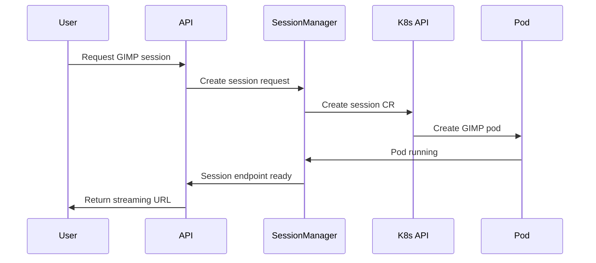
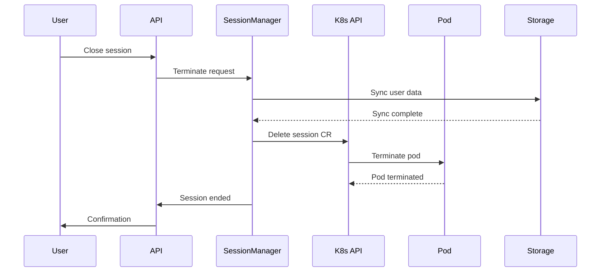

# Kubernetes Orchestration Architecture

## Overview

The GIMP Streaming Platform uses Kubernetes for container orchestration, implementing a 1:1 pod-per-user pattern for isolation and resource management.

## Cluster Architecture

### Node Pool Strategy

```
Kubernetes Cluster
├── Control Plane (3+ masters)
├── CPU Node Pool (General purpose)
├── GPU Node Pool (NVIDIA acceleration)
├── Storage Node Pool (High I/O SSD)
└── Edge Node Pool (Geographic distribution)
```

**Node Pool Configurations:**

**CPU Node Pool:**
- Instance: c6g.4xlarge (16 vCPU, 32GB RAM)
- Purpose: General application streaming
- Density: ~8-12 concurrent GIMP sessions per node
- Autoscaling: 1-50 nodes based on demand

**GPU Node Pool:**
- Instance: g4dn.xlarge (4 vCPU, 16GB RAM, 1x T4 GPU)
- Purpose: GPU-accelerated image processing
- GPU Time-slicing: 4-8 users per GPU
- Autoscaling: 0-20 nodes based on GPU demand

**Storage Node Pool:**
- Instance: i3.4xlarge (16 vCPU, 128GB RAM, 2x NVMe)
- Purpose: High-performance storage I/O
- Storage: Local NVMe for temporary files
- Network: 10Gbps for storage traffic

## Pod Architecture

### Session Pod Design

**Pod Template:**
```yaml
apiVersion: v1
kind: Pod
metadata:
  name: gimp-session-{user-id}
  labels:
    app: gimp-session
    user: {user-id}
    tier: streaming
spec:
  securityContext:
    runAsNonRoot: true
    runAsUser: 1000
    runAsGroup: 1000
    fsGroup: 1000
  containers:
  - name: gimp-container
    image: gimp-streaming-platform/gimp:latest
    resources:
      requests:
        cpu: "1"
        memory: "2Gi"
        nvidia.com/gpu: "0.25"
      limits:
        cpu: "2"
        memory: "4Gi"
        nvidia.com/gpu: "0.5"
    ports:
    - containerPort: 6901
      name: webrtc
      protocol: TCP
    - containerPort: 5901
      name: vnc
      protocol: TCP
    env:
    - name: DISPLAY
      value: ":99"
    - name: USER_ID
      valueFrom:
        fieldRef:
          fieldPath: metadata.labels['user']
    volumeMounts:
    - name: user-storage
      mountPath: /home/user
    - name: temp-storage
      mountPath: /tmp
    readinessProbe:
      httpGet:
        path: /health
        port: 6901
      initialDelaySeconds: 30
      periodSeconds: 10
    livenessProbe:
      httpGet:
        path: /health
        port: 6901
      initialDelaySeconds: 60
      periodSeconds: 30

  - name: rclone-sidecar
    image: rclone/rclone:latest
    securityContext:
      privileged: true
    command: ["rclone", "mount"]
    args: ["remote:", "/data/cloud", "--allow-other", "--vfs-cache-mode", "writes"]
    env:
    - name: RCLONE_CONFIG
      valueFrom:
        secretKeyRef:
          name: user-cloud-credentials
          key: config
    volumeMounts:
    - name: cloud-storage
      mountPath: /data/cloud
      mountPropagation: Bidirectional
    resources:
      requests:
        cpu: "0.1"
        memory: "128Mi"
      limits:
        cpu: "0.5"
        memory: "512Mi"

  volumes:
  - name: user-storage
    persistentVolumeClaim:
      claimName: user-storage-{user-id}
  - name: temp-storage
    emptyDir:
      sizeLimit: 1Gi
  - name: cloud-storage
    emptyDir: {}
```

### Resource Management

**CPU Resource Allocation:**
- **Request**: 1 vCPU per session (guaranteed)
- **Limit**: 2 vCPU per session (burst capability)
- **QoS Class**: Burstable for efficient resource utilization
- **CPU Pinning**: Optional for performance-critical sessions

**Memory Resource Allocation:**
- **Request**: 2GB RAM per session
- **Limit**: 4GB RAM per session
- **Swap**: Disabled for predictable performance
- **OOM Handling**: Graceful shutdown before OOM kill

**GPU Resource Allocation:**
- **Time-slicing**: 0.25 GPU per user request
- **Limits**: 0.5 GPU maximum per session
- **MIG Support**: A100 GPUs with 7 instances per card
- **GPU Memory**: 2GB per user minimum

## Session Management

### Session Controller

**Custom Resource Definition:**
```yaml
apiVersion: apiextensions.k8s.io/v1
kind: CustomResourceDefinition
metadata:
  name: sessions.streaming.platform
spec:
  group: streaming.platform
  versions:
  - name: v1
    served: true
    storage: true
    schema:
      openAPIV3Schema:
        type: object
        properties:
          spec:
            type: object
            properties:
              userId:
                type: string
              application:
                type: string
                enum: ["gimp", "blender", "inkscape"]
              resources:
                type: object
                properties:
                  cpu:
                    type: string
                  memory:
                    type: string
                  gpu:
                    type: string
              storage:
                type: object
                properties:
                  size:
                    type: string
                  class:
                    type: string
              timeout:
                type: integer
          status:
            type: object
            properties:
              phase:
                type: string
                enum: ["pending", "running", "terminating", "failed"]
              podName:
                type: string
              startTime:
                type: string
              endpoint:
                type: string
```

**Controller Logic:**
```go
func (r *SessionReconciler) Reconcile(ctx context.Context, req ctrl.Request) (ctrl.Result, error) {
    // Fetch session CR
    session := &streamingv1.Session{}
    if err := r.Get(ctx, req.NamespacedName, session); err != nil {
        return ctrl.Result{}, client.IgnoreNotFound(err)
    }

    // Check if pod already exists
    pod := &corev1.Pod{}
    err := r.Get(ctx, types.NamespacedName{Name: session.Status.PodName, Namespace: session.Namespace}, pod)

    if errors.IsNotFound(err) {
        // Create new pod for session
        pod := r.createPodForSession(session)
        if err := r.Create(ctx, pod); err != nil {
            return ctrl.Result{}, err
        }
        session.Status.Phase = "pending"
        session.Status.PodName = pod.Name
    }

    // Update session status based on pod status
    if pod.Status.Phase == corev1.PodRunning {
        session.Status.Phase = "running"
        session.Status.Endpoint = r.getEndpointForPod(pod)
    }

    return r.Update(ctx, session)
}
```

### Session Lifecycle

**1. Session Creation:**


**2. Session Termination:**


## Storage Architecture

### Persistent Volume Strategy

**Storage Classes:**
```yaml
apiVersion: storage.k8s.io/v1
kind: StorageClass
metadata:
  name: ssd-user-storage
provisioner: kubernetes.io/aws-ebs
parameters:
  type: gp3
  iops: "3000"
  throughput: "125"
  fsType: ext4
allowVolumeExpansion: true
reclaimPolicy: Delete
volumeBindingMode: WaitForFirstConsumer

---
apiVersion: storage.k8s.io/v1
kind: StorageClass
metadata:
  name: nvme-temp-storage
provisioner: kubernetes.io/no-provisioner
volumeBindingMode: WaitForFirstConsumer
allowVolumeExpansion: false
reclaimPolicy: Delete
```

**User PVC Template:**
```yaml
apiVersion: v1
kind: PersistentVolumeClaim
metadata:
  name: user-storage-{user-id}
  labels:
    user: {user-id}
    type: persistent
spec:
  accessModes:
  - ReadWriteOnce
  storageClassName: ssd-user-storage
  resources:
    requests:
      storage: 20Gi
```

### Backup Strategy

**Snapshot Controller:**
```yaml
apiVersion: snapshot.storage.k8s.io/v1
kind: VolumeSnapshotClass
metadata:
  name: ebs-snapshots
driver: ebs.csi.aws.com
deletionPolicy: Retain
parameters:
  type: gp3

---
apiVersion: snapshot.storage.k8s.io/v1
kind: VolumeSnapshot
metadata:
  name: user-snapshot-{user-id}-{timestamp}
  labels:
    user: {user-id}
spec:
  volumeSnapshotClassName: ebs-snapshots
  source:
    persistentVolumeClaimName: user-storage-{user-id}
```

## Autoscaling Strategy

### Horizontal Pod Autoscaling

**HPA Configuration:**
```yaml
apiVersion: autoscaling/v2
kind: HorizontalPodAutoscaler
metadata:
  name: gimp-session-hpa
spec:
  scaleTargetRef:
    apiVersion: apps/v1
    kind: Deployment
    name: session-manager
  minReplicas: 2
  maxReplicas: 20
  metrics:
  - type: Resource
    resource:
      name: cpu
      target:
        type: Utilization
        averageUtilization: 70
  - type: Resource
    resource:
      name: memory
      target:
        type: Utilization
        averageUtilization: 80
  behavior:
    scaleUp:
      stabilizationWindowSeconds: 60
      policies:
      - type: Percent
        value: 100
        periodSeconds: 15
    scaleDown:
      stabilizationWindowSeconds: 300
      policies:
      - type: Percent
        value: 10
        periodSeconds: 60
```

### Cluster Autoscaling

**Node Pool Autoscaling:**
```yaml
apiVersion: v1
kind: ConfigMap
metadata:
  name: cluster-autoscaler-status
data:
  nodes.max: "100"
  nodes.min: "3"
  scale-down-utilization-threshold: "0.5"
  scale-down-unneeded-time: "10m"
  scale-down-delay-after-add: "10m"
```

**Custom Autoscaler Logic:**
```go
func (a *Autoscaler) calculateRequiredNodes(activeSessions int, gpuSessions int) (cpuNodes, gpuNodes int) {
    // CPU nodes calculation
    cpuSessionPerNode := 10 // conservative estimate
    cpuNodes = int(math.Ceil(float64(activeSessions-gpuSessions) / float64(cpuSessionPerNode)))

    // GPU nodes calculation
    gpuSessionPerGPU := 4 // time-slicing ratio
    gpuSessionPerNode := 2 // 2 GPUs per node
    gpuNodes = int(math.Ceil(float64(gpuSessions) / float64(gpuSessionPerNode*gpuSessionPerGPU)))

    // Add buffer for scale-up latency
    cpuNodes = int(float64(cpuNodes) * 1.2)
    gpuNodes = int(float64(gpuNodes) * 1.2)

    return cpuNodes, gpuNodes
}
```

## Network Architecture

### Service Mesh

**Istio Configuration:**
```yaml
apiVersion: networking.istio.io/v1beta1
kind: Gateway
metadata:
  name: gimp-streaming-gateway
spec:
  selector:
    istio: ingressgateway
  servers:
  - port:
      number: 443
      name: https
      protocol: HTTPS
    tls:
      mode: SIMPLE
      credentialName: gimp-streaming-tls
    hosts:
    - gimp.example.com

---
apiVersion: networking.istio.io/v1beta1
kind: VirtualService
metadata:
  name: gimp-session-route
spec:
  hosts:
  - gimp.example.com
  gateways:
  - gimp-streaming-gateway
  http:
  - match:
    - uri:
        prefix: /session/
    rewrite:
      uri: /
    route:
    - destination:
        host: session-manager
        port:
          number: 8080
    timeout: 30s
  - match:
    - uri:
        regex: /streaming/.*
    route:
    - destination:
        host: webrtc-gateway
        port:
          number: 8080
    timeout: 24h
```

### Network Policies

**Default Deny Policy:**
```yaml
apiVersion: networking.k8s.io/v1
kind: NetworkPolicy
metadata:
  name: default-deny-all
spec:
  podSelector: {}
  policyTypes:
  - Ingress
  - Egress
```

**Session Pod Policy:**
```yaml
apiVersion: networking.k8s.io/v1
kind: NetworkPolicy
metadata:
  name: gimp-session-netpol
spec:
  podSelector:
    matchLabels:
      app: gimp-session
  policyTypes:
  - Ingress
  - Egress
  ingress:
  - from:
    - namespaceSelector:
        matchLabels:
          name: istio-system
    ports:
    - protocol: TCP
      port: 6901
    - protocol: TCP
      port: 5901
  egress:
  - to: []
    ports:
    - protocol: TCP
      port: 443
    - protocol: TCP
      port: 80
    - protocol: UDP
      port: 53
  - to:
    - namespaceSelector:
        matchLabels:
          name: storage
    ports:
    - protocol: TCP
      port: 443
```

## Security Architecture

### Pod Security Standards

**Restricted Security Policy:**
```yaml
apiVersion: policy/v1beta1
kind: PodSecurityPolicy
metadata:
  name: restricted
spec:
  privileged: false
  allowPrivilegeEscalation: false
  requiredDropCapabilities:
  - ALL
  volumes:
  - 'configMap'
  - 'emptyDir'
  - 'projected'
  - 'secret'
  - 'downwardAPI'
  - 'persistentVolumeClaim'
  runAsUser:
    rule: 'MustRunAsNonRoot'
  seLinux:
    rule: 'RunAsAny'
  fsGroup:
    rule: 'RunAsAny'
```

### RBAC Configuration

**ServiceAccount Permissions:**
```yaml
apiVersion: rbac.authorization.k8s.io/v1
kind: Role
metadata:
  name: session-manager-role
rules:
- apiGroups: [""]
  resources: ["pods", "services", "configmaps", "secrets"]
  verbs: ["get", "list", "watch", "create", "update", "patch", "delete"]
- apiGroups: ["apps"]
  resources: ["deployments", "replicasets"]
  verbs: ["get", "list", "watch", "create", "update", "patch", "delete"]
- apiGroups: ["streaming.platform"]
  resources: ["sessions", "sessions/status"]
  verbs: ["get", "list", "watch", "create", "update", "patch", "delete"]

---
apiVersion: rbac.authorization.k8s.io/v1
kind: RoleBinding
metadata:
  name: session-manager-binding
subjects:
- kind: ServiceAccount
  name: session-manager
  namespace: default
roleRef:
  kind: Role
  name: session-manager-role
  apiGroup: rbac.authorization.k8s.io
```

## Monitoring and Observability

### Prometheus Metrics

**Custom Session Metrics:**
```go
var (
    sessionTotal = prometheus.NewCounterVec(
        prometheus.CounterOpts{
            Name: "gimp_sessions_total",
            Help: "Total number of GIMP sessions created",
        },
        []string{"user_tier", "region"},
    )

    sessionDuration = prometheus.NewHistogramVec(
        prometheus.HistogramOpts{
            Name: "gimp_session_duration_seconds",
            Help: "Duration of GIMP sessions",
            Buckets: prometheus.ExponentialBuckets(60, 2, 10),
        },
        []string{"user_tier"},
    )

    activeSessions = prometheus.NewGaugeVec(
        prometheus.GaugeOpts{
            Name: "gimp_active_sessions",
            Help: "Number of currently active GIMP sessions",
        },
        []string{"node_type", "region"},
    )
)
```

### Logging Strategy

**Structured Logging Format:**
```json
{
  "timestamp": "2024-01-15T10:30:00Z",
  "level": "info",
  "component": "session-manager",
  "user_id": "user-123",
  "session_id": "session-456",
  "action": "session_created",
  "duration_ms": 2500,
  "pod_name": "gimp-session-user-123-abcde",
  "node_name": "worker-node-3",
  "region": "us-east-1",
  "resource_allocation": {
    "cpu": "1000m",
    "memory": "2Gi",
    "gpu": "0.25"
  }
}
```

## Disaster Recovery

### Backup Strategy

**Etcd Backup:**
```bash
#!/bin/bash
ETCDCTL_API=3 etcdctl snapshot save \
  --endpoints=https://[etcd-ip]:2379 \
  --cacert=/etc/kubernetes/pki/etcd/ca.crt \
  --cert=/etc/kubernetes/pki/etcd/server.crt \
  --key=/etc/kubernetes/pki/etcd/server.key \
  /backup/etcd-$(date +%Y%m%d-%H%M%S).db
```

**Application State Backup:**
```yaml
apiVersion: batch/v1
kind: CronJob
metadata:
  name: user-data-backup
spec:
  schedule: "0 2 * * *"
  jobTemplate:
    spec:
      template:
        spec:
          containers:
          - name: backup
            image: aws-cli:latest
            command:
            - /bin/bash
            - -c
            - |
              aws s3 sync /s3-user-bucket/ s3://backup-bucket/$(date +%Y%m%d)/
          restartPolicy: OnFailure
```