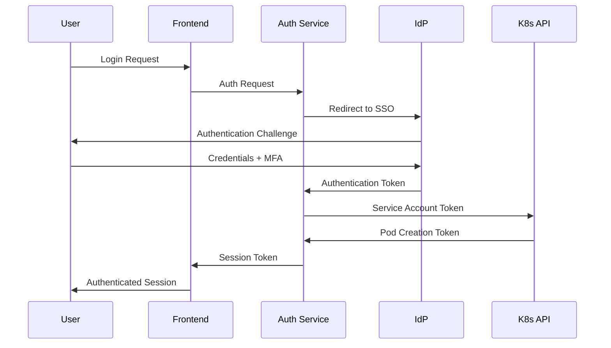

# Security Framework

## Executive Summary

The GIMP Streaming Platform implements a defense-in-depth security architecture to protect user data, ensure service availability, and maintain compliance with industry standards. This comprehensive security framework addresses threats at the infrastructure, application, network, and data layers.

## Security Architecture Overview

### Defense-in-Depth Model

```
┌─────────────────────────────────────────────────────────────┐
│                    User Security Layer                      │
│  ┌─────────────┐  ┌─────────────┐  ┌─────────────────────┐  │
│  │  SSO/OAuth  │  │   MFA       │  │   Session Mgmt      │  │
│  │  Integration│  │   Support   │  │   & Tokens          │  │
│  └─────────────┘  └─────────────┘  └─────────────────────┘  │
└─────────────────────────────────────────────────────────────┘
┌─────────────────────────────────────────────────────────────┐
│                  Application Security                        │
│  ┌─────────────┐  ┌─────────────┐  ┌─────────────────────┐  │
│  │   Input     │  │  Output     │  │    API Security     │  │
│  │ Validation  │  │ Encoding    │  │   & Rate Limiting   │  │
│  └─────────────┘  └─────────────┘  └─────────────────────┘  │
└─────────────────────────────────────────────────────────────┘
┌─────────────────────────────────────────────────────────────┐
│                  Container Security                         │
│  ┌─────────────┐  ┌─────────────┐  ┌─────────────────────┐  │
│  │ Image       │  │ Runtime     │  │    Pod Security     │  │
│  │ Scanning    │  │ Monitoring  │  │   Standards         │  │
│  └─────────────┘  └─────────────┘  └─────────────────────┘  │
└─────────────────────────────────────────────────────────────┘
┌─────────────────────────────────────────────────────────────┐
│                   Network Security                           │
│  ┌─────────────┐  ┌─────────────┐  ┌─────────────────────┐  │
│  │   Network   │  │   Firewall  │  │   DDoS Protection   │  │
│  │ Policies    │  │ Rules       │  │   & Traffic Filter  │  │
│  └─────────────┘  └─────────────┘  └─────────────────────┘  │
└─────────────────────────────────────────────────────────────┘
┌─────────────────────────────────────────────────────────────┐
│                    Infrastructure Security                   │
│  ┌─────────────┐  ┌─────────────┐  ┌─────────────────────┐  │
│  │  IAM & RBAC │  │   Secrets   │  │    Audit Logging    │  │
│  │  Controls   │  │ Management  │  │   & Monitoring      │  │
│  └─────────────┘  └─────────────┘  └─────────────────────┘  │
└─────────────────────────────────────────────────────────────┘
```

## Identity and Access Management

### Authentication Framework

#### Multi-Factor Authentication (MFA)
```
Authentication Methods:
- TOTP (Time-based One-Time Password)
- SMS-based verification codes
- Email-based verification
- Hardware security keys (WebAuthn/U2F)
- Biometric authentication (mobile devices)

Implementation:
- Required for all administrator accounts
- Optional for standard user accounts
- Graduated authentication based on risk score
```

#### Single Sign-On (SSO) Integration
```
Supported Providers:
- Google Workspace
- Microsoft Azure AD
- Okta
- Auth0
- SAML 2.0
- OpenID Connect (OIDC)

Security Features:
- Token-based authentication with JWT
- Refresh token rotation
- Session timeout and renewal
- Device fingerprinting
```

#### User Authentication Flow


### Authorization Model

#### Role-Based Access Control (RBAC)
```yaml
# Kubernetes RBAC Configuration
apiVersion: rbac.authorization.k8s.io/v1
kind: Role
metadata:
  name: user-role
rules:
- apiGroups: [""]
  resources: ["pods", "services"]
  verbs: ["get", "list", "watch"]
- apiGroups: ["streaming.platform"]
  resources: ["sessions"]
  verbs: ["create", "get", "delete"]
```

#### Permission Hierarchy
```
Administrator:
- Full system access
- User management
- Configuration management
- Audit log access

Support Staff:
- User session access (view only)
- Support tools access
- Limited user management

Standard Users:
- Own session management
- File access within own storage
- Profile management

Guest Users:
- Limited session access
- Read-only file access
- Temporary permissions
```

## Container Security

### Image Security

#### Multi-Stage Build Security
```dockerfile
# Build stage with compilation tools
FROM ubuntu:22.04 as builder
RUN apt-get update && apt-get install -y build-essential

# Production stage minimal attack surface
FROM ubuntu:22.04 as production
# Install only runtime dependencies
COPY --from=builder /app /app
# Security hardening
RUN chmod -x /usr/bin/chmod && \
    chmod -x /usr/bin/sudo && \
    rm -rf /etc/shadow* /etc/passwd-
```

#### Container Image Scanning
```yaml
# Kubernetes Admission Controller for Image Security
apiVersion: admissionregistration.k8s.io/v1
kind: ValidatingWebhookConfiguration
metadata:
  name: image-security-webhook
webhooks:
- name: image-security-validator
  rules:
  - apiGroups: [""]
    resources: ["pods"]
    operations: ["CREATE"]
  clientConfig:
    service:
      name: image-security-service
      path: "/validate"
```

#### Security Scanning Pipeline
```bash
#!/bin/bash
# CI/CD Pipeline Security Scanning

# Trivy vulnerability scanning
trivy image --severity HIGH,CRITICAL gimp-platform/gimp:latest

# Docker Scout security analysis
docker scout cves gimp-platform/gimp:latest

# Custom security checks
./scripts/security-checks.sh

# Image signing with Cosign
cosign sign gimp-platform/gimp:latest
```

### Runtime Security

#### Pod Security Standards
```yaml
apiVersion: policy/v1beta1
kind: PodSecurityPolicy
metadata:
  name: restricted-psp
spec:
  privileged: false
  allowPrivilegeEscalation: false
  requiredDropCapabilities:
    - ALL
  volumes:
    - 'configMap'
    - 'emptyDir'
    - 'projected'
    - 'secret'
    - 'downwardAPI'
    - 'persistentVolumeClaim'
  runAsUser:
    rule: 'MustRunAsNonRoot'
  seLinux:
    rule: 'RunAsAny'
  fsGroup:
    rule: 'RunAsAny'
  readOnlyRootFilesystem: true
```

#### Security Context Configuration
```yaml
securityContext:
  runAsNonRoot: true
  runAsUser: 1000
  runAsGroup: 1000
  fsGroup: 1000
  allowPrivilegeEscalation: false
  readOnlyRootFilesystem: true
  capabilities:
    drop:
    - ALL
  seccompProfile:
    type: RuntimeDefault
```

### Runtime Monitoring

#### Falco Runtime Security
```yaml
# Falco Rules for Container Security
- rule: Detect shell in container
  desc: Detect shell spawned in container
  condition: >
    spawned_process and
    container and
    proc.name in (bash, sh, zsh, ksh) and
    not user.name in (allowed_users)
  output: >
    Shell spawned in container (user=%user.name container=%container.name
    command=%proc.cmdline)
  priority: WARNING

- rule: Sensitive file access in container
  desc: Detect access to sensitive files
  condition: >
    open_read and
    container and
    fd.name in (/etc/passwd, /etc/shadow, /etc/hosts)
  output: >
    Sensitive file accessed in container (user=%user.name
    file=%fd.name container=%container.name)
  priority: HIGH
```

#### OPA/Gatekeeper Policy Enforcement
```yaml
apiVersion: templates.gatekeeper.sh/v1beta1
kind: ConstraintTemplate
metadata:
  name: k8srequiredlabels
spec:
  crd:
    spec:
      names:
        kind: K8sRequiredLabels
  targets:
    - target: admission.k8s.gatekeeper.sh
      rego: |
        package k8srequiredlabels

        violation[{"msg": msg}] {
          required := input.parameters.labels
          provided := input.review.object.metadata.labels
          missing := {x | x := required[_]; not provided[x]}
          count(missing) > 0
          msg := sprintf("Missing required labels: %v", [missing])
        }
```

## Network Security

### Network Policies

#### Default Deny Policy
```yaml
apiVersion: networking.k8s.io/v1
kind: NetworkPolicy
metadata:
  name: default-deny-all
spec:
  podSelector: {}
  policyTypes:
  - Ingress
  - Egress
```

#### Application-Specific Network Policy
```yaml
apiVersion: networking.k8s.io/v1
kind: NetworkPolicy
metadata:
  name: gimp-session-netpol
spec:
  podSelector:
    matchLabels:
      app: gimp-session
  policyTypes:
  - Ingress
  - Egress
  ingress:
  - from:
    - namespaceSelector:
        matchLabels:
          name: ingress-nginx
    ports:
    - protocol: TCP
      port: 6901
  egress:
  - to: []
    ports:
    - protocol: TCP
      port: 443
    - protocol: TCP
      port: 53
    - protocol: UDP
      port: 53
  - to:
    - namespaceSelector:
        matchLabels:
          name: storage
    ports:
    - protocol: TCP
      port: 443
```

### Service Mesh Security

#### Istio Security Configuration
```yaml
apiVersion: security.istio.io/v1beta1
kind: PeerAuthentication
metadata:
  name: default
  namespace: default
spec:
  mtls:
    mode: STRICT

---
apiVersion: security.istio.io/v1beta1
kind: AuthorizationPolicy
metadata:
  name: gimp-session-authz
  namespace: default
spec:
  selector:
    matchLabels:
      app: gimp-session
  rules:
  - from:
    - source:
        principals: ["cluster.local/ns/default/sa/frontend-sa"]
  - to:
    - operation:
        methods: ["GET", "POST"]
```

### DDoS Protection

#### Rate Limiting Configuration
```yaml
apiVersion: networking.istio.io/v1beta1
kind: EnvoyFilter
metadata:
  name: rate-limit-filter
spec:
  configPatches:
  - applyTo: HTTP_FILTER
    match:
      context: SIDECAR_INBOUND
      listener:
        filterChain:
          filter:
            name: "envoy.filters.network.http_connection_manager"
    patch:
      operation: INSERT_BEFORE
      value:
        name: envoy.filters.http.local_ratelimit
        typed_config:
          "@type": type.googleapis.com/udpa.type.v1.TypedStruct
          type_url: type.googleapis.com/envoy.extensions.filters.http.local_rate_limit.v3.LocalRateLimit
          value:
            stat_prefix: http_local_rate_limiter
            token_bucket:
              max_tokens: 100
              tokens_per_fill: 10
              fill_interval: 1s
            filter_enabled:
              runtime_key: local_rate_limit_enabled
              default_value:
                numerator: 100
                denominator: HUNDRED
            filter_enforced:
              runtime_key: local_rate_limit_enforced
              default_value:
                numerator: 100
                denominator: HUNDRED
```

## Data Security

### Encryption

#### Data at Rest Encryption
```yaml
# Encrypted Persistent Volumes
apiVersion: v1
kind: PersistentVolumeClaim
metadata:
  name: encrypted-user-storage
spec:
  accessModes:
  - ReadWriteOnce
  storageClassName: encrypted-ssd
  resources:
    requests:
      storage: 20Gi
```

#### Data in Transit Encryption
```yaml
# TLS Configuration for WebRTC
apiVersion: v1
kind: ConfigMap
metadata:
  name: webrtc-tls-config
data:
  turnserver.conf: |
    use-auth-secret
    static-auth-secret=${TURN_SECRET}
    realm=gimp-streaming.com
    cert=/etc/ssl/certs/turnserver.crt
    pkey=/etc/ssl/private/turnserver.key
    tls-port=443
    total-quota=100
    user-quota=12
    max-bps=64000
```

### Secrets Management

#### Kubernetes Secrets with External Secret Operator
```yaml
apiVersion: external-secrets.io/v1beta1
kind: SecretStore
metadata:
  name: vault-backend
spec:
  provider:
    vault:
      server: "https://vault.example.com"
      path: "secret"
      version: "v2"
      auth:
        kubernetes:
          mountPath: "kubernetes"
          role: "gimp-platform-role"

---
apiVersion: external-secrets.io/v1beta1
kind: ExternalSecret
metadata:
  name: database-credentials
spec:
  refreshInterval: 1h
  secretStoreRef:
    name: vault-backend
    kind: SecretStore
  target:
    name: database-credentials
    creationPolicy: Owner
  data:
  - secretKey: username
    remoteRef:
      key: database/credentials
      property: username
  - secretKey: password
    remoteRef:
      key: database/credentials
      property: password
```

### Data Loss Prevention (DLP)

#### Content Scanning Pipeline
```go
package main

// DLP Scanner Implementation
type DLPScanner struct {
    patterns []string
    keywords []string
}

func (s *DLPScanner) ScanContent(content []byte) (*ScanResult, error) {
    result := &ScanResult{
        Violations: []Violation{},
    }

    // Scan for sensitive patterns
    for _, pattern := range s.patterns {
        if matched, _ := regexp.MatchString(pattern, string(content)); matched {
            result.Violations = append(result.Violations, Violation{
                Type:    "PatternMatch",
                Pattern: pattern,
                Severity: "HIGH",
            })
        }
    }

    return result, nil
}
```

## Compliance and Governance

### GDPR Compliance

#### Data Subject Rights Implementation
```go
type DataSubjectController struct {
    database *sql.DB
    storage  S3Client
}

func (c *DataSubjectController) DeleteUserData(userID string) error {
    // Delete user from database
    _, err := c.database.Exec("DELETE FROM users WHERE id = ?", userID)
    if err != nil {
        return err
    }

    // Delete user files from storage
    prefix := fmt.Sprintf("users/%s/", userID)
    err = c.storage.DeleteObjects(prefix)
    if err != nil {
        return err
    }

    // Audit log entry
    c.logDataDeletion(userID)

    return nil
}
```

### SOC 2 Compliance

#### Security Controls Framework
```yaml
apiVersion: v1
kind: ConfigMap
metadata:
  name: soc2-controls
data:
  controls.yaml: |
    security_controls:
      access_control:
        - user_authentication_mfa
        - session_timeout_15min
        - privileged_access_review
      data_protection:
        - encryption_at_rest_aes256
        - encryption_in_transit_tls13
        - data_classification_policy
      monitoring:
        - security_event_logging
        - real_time_alerting
        - quarterly_penetration_testing
      availability:
        - sla_99.9_percent
        - disaster_recovery_plan
        - backup_retention_30days
```

### Audit Logging

#### Comprehensive Audit Trail
```go
type AuditLogger struct {
    logger *logrus.Logger
}

type AuditEvent struct {
    Timestamp   time.Time                  `json:"timestamp"`
    UserID      string                     `json:"user_id,omitempty"`
    Action      string                     `json:"action"`
    Resource    string                     `json:"resource"`
    IPAddress   string                     `json:"ip_address"`
    UserAgent   string                     `json:"user_agent"`
    Result      string                     `json:"result"`
    Metadata    map[string]interface{}     `json:"metadata,omitempty"`
}

func (a *AuditLogger) LogEvent(event AuditEvent) {
    event.Timestamp = time.Now().UTC()

    // Structured logging
    a.logger.WithFields(logrus.Fields{
        "event_type": "audit",
        "user_id":    event.UserID,
        "action":     event.Action,
        "resource":   event.Resource,
        "ip":         event.IPAddress,
        "result":     event.Result,
    }).Info("Security audit event")

    // Send to SIEM system
    a.sendToSIEM(event)
}
```

## Incident Response

### Security Incident Response Plan

#### Incident Classification
```
Level 1 - Low:
- Suspicious login attempts
- Minor configuration changes
- User access violations

Level 2 - Medium:
- Confirmed unauthorized access
- Data exposure incidents
- Service degradation attacks

Level 3 - High:
- Large scale data breaches
- Complete service outage
- Advanced persistent threats

Level 4 - Critical:
- Nation-state attacks
- Catastrophic data loss
- Extended service disruption
```

#### Response Procedures
```yaml
apiVersion: v1
kind: ConfigMap
metadata:
  name: incident-response-procedures
data:
  procedures.md: |
    # Incident Response Procedures

    ## 1. Detection and Analysis
    - Automated monitoring alerts
    - Security team triage
    - Impact assessment
    - Classification and prioritization

    ## 2. Containment
    - Isolate affected systems
    - Block malicious IPs
    - Suspend compromised accounts
    - Preserve evidence

    ## 3. Eradication
    - Remove malware/malicious actors
    - Patch vulnerabilities
    - Reset credentials
    - Validate remediation

    ## 4. Recovery
    - Restore from backups
    - Validate system integrity
    - Monitor for recurrence
    - Document lessons learned

    ## 5. Post-Incident Activities
    - Root cause analysis
    - Security improvements
    - Process updates
    - Stakeholder communication
```

### Security Monitoring Dashboard

#### Real-time Security Metrics
```yaml
apiVersion: v1
kind: ConfigMap
metadata:
  name: security-dashboard-config
data:
  dashboard.json: |
    {
      "panels": [
        {
          "title": "Failed Login Attempts",
          "type": "graph",
          "targets": [
            {
              "expr": "rate(failed_login_total[5m])",
              "legendFormat": "Failed Logins/sec"
            }
          ]
        },
        {
          "title": "Security Events",
          "type": "table",
          "targets": [
            {
              "expr": "security_events_total",
              "legendFormat": "Total Events"
            }
          ]
        },
        {
          "title": "Vulnerability Scan Results",
          "type": "stat",
          "targets": [
            {
              "expr": "vulnerabilities_critical_total",
              "legendFormat": "Critical"
            },
            {
              "expr": "vulnerabilities_high_total",
              "legendFormat": "High"
            }
          ]
        }
      ]
    }
```

This comprehensive security framework provides a robust foundation for protecting the GIMP Streaming Platform against modern cyber threats while ensuring compliance with industry standards and regulations.